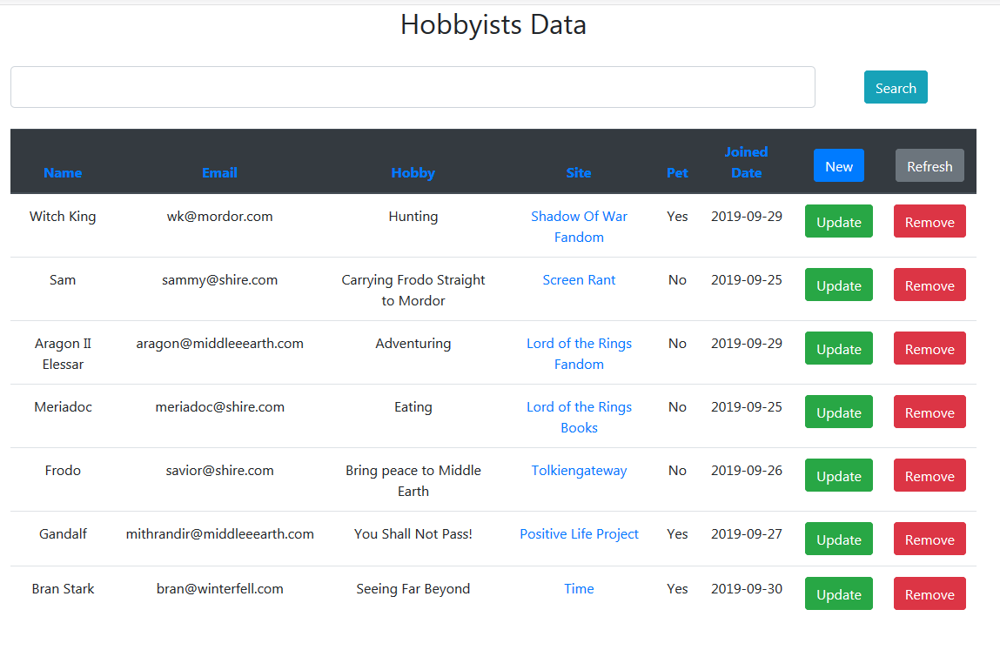

# Hobbyists-Data

Software Requirements:

1. Eclipse IDE with Java EE

2. Apache Tomcat 8 (need to be exact version)

3. MySQL Server 5.7

4. Other files will be in lib Folder (path: WebContent/WEB-INF/lib/)

# Features:

1. CRUD application built using Spring and Hibernate on the backend.

2. User Interface built using Bootstrap 4.

3. Displaying ascending order when users choose to click on any header columns.

4. Searching will match a keyword on name, email, hobby and favorite site columns.

5. Joined Dates are automatically generated when users create a new hobbyist.

# Screenshots

Overview:

